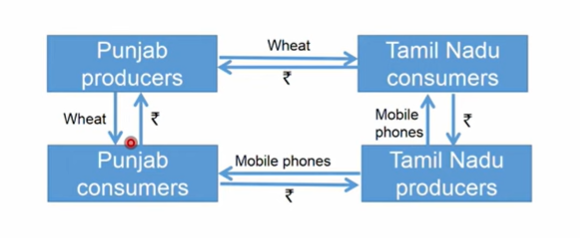
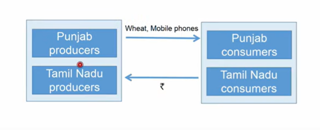
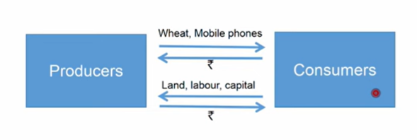
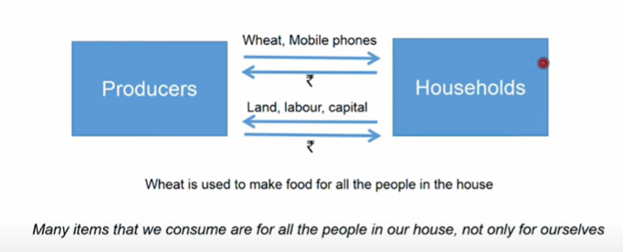
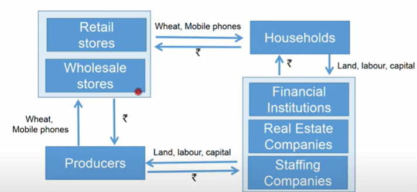
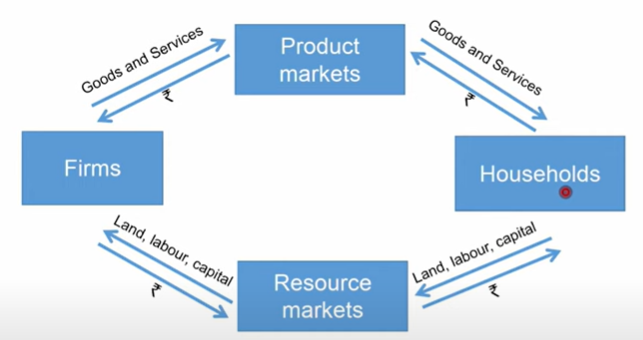
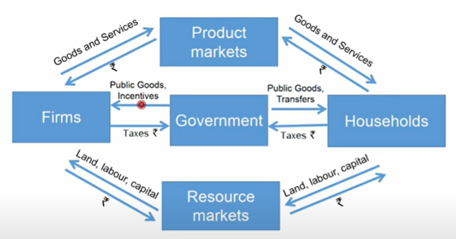
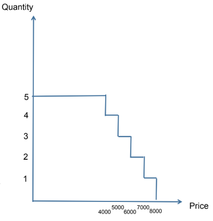
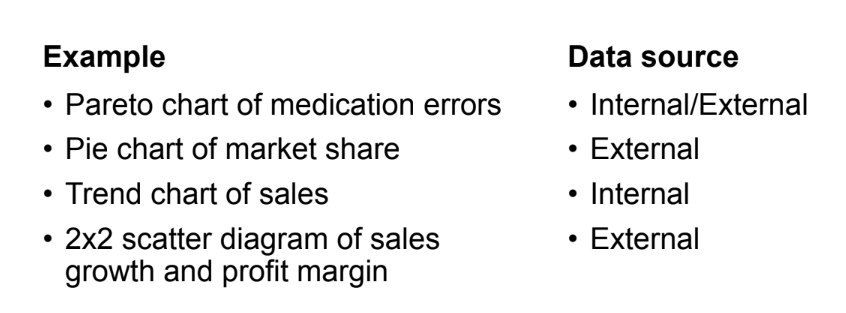

# Week 1 - Intro 
## Intro to Economics 1:
- comes in handy when you want to understnad what kind of profits company makes inernally or externally, and understand the overall working of the company.
- economics tries to create mathematical models that can be used to explain the economic behaviour of people and firms.
- **Trade Creates Value**

    > - To illustrate this, let's take the example of two states: Punjab and Tamil Nadu. Punjab produces excess wheat, which the locals can't consume entirely. Tamil Nadu, on the other hand, produces excess phones. A viable option for both states is that Punjab gives its excess wheat to Tamil Nadu, and in return, Tamil Nadu gives its excess phones to Punjab. This is called **barter**.
    > - Value is created in the sense that both states have something they produce in excess, which has little value to them locally. Through barter, these excess goods gain value in the exchanged states, thereby **generating value**. 
    > - **Money** later replaces this barter system by assigning a monetary value to goods, which also includes the cost of transportation (where institutions like the **RBI** come into play).
    > to visualize
    >    - 
    >    - 
    > - in the second image, the money flow is only 1 directional, so where is the consumers getting the money from ? thats wehre employment and income comes from, the porducers provide some form of employment to the consumers which generates income for the consumers.
    >   - 
    > - an interersting point here is that, the consumer is ussually not a single person, it could as well be a bunch of people, could be his/her family members, so the concumer si generally replaced by households, on which doing surveys is easier.
    >   - 
    > ## Circular flow model.
    > also its not like the producer is directly giving the goods to the households, there is an entire ecosystem which comes into play while making such transactions, in which ***value*** is generated at each step.
    >   - 
    > - where everything except the household is called a firm, which constituest of a whole ***suply chain***.
    >   - 
    >   - 
    > government reagulates all the kinds of activities that happen between firms and houeholds, eg giving liscenses and taking taxes, law and order etc.
    >   - 
    > - but the government might also set up its firms where private firms won't have any incentive to make/give services, these would be called public centre entierprise, on the other hand gov might also consume certain resources from the households aprat from taxes, such as officers.
## Intro to econ 2:
- ### the law of demand and supply.
    - here we introduce the concept of willingness to pay, where we only talk about 1 supplier and 1 consumer/person/household.
    - here we try to construct a distribution of quantity vs price. i.e 
        1. Single customer who is willing to pay Rs 8000 for a smart phone. 
        2. If there is any producer who is willing to sell a phone below Rs 8000, then one phone will be sold in the market
        3. If there is another customer who is only willingto pay Rs 7000, then:
            - two phones will be sold in the market only if the
            price is below Rs 7000. 
        4. between 7000-8000, only one phone will be sold
        5. above 8000, no phones will be sold
        6. If there are 5 customers with willingness to pay:
            - at Rs 4000, 5000, 6000, 7000, 8000 respectively
            - then the demand for phones will be as shown in the figure
            - 
    - the smae goes for the contineous case.
- Majority of the data sets and analyses that we will come across will be from the space of business:

    • from within companies

    • from the markets in which the companies operate
- We can use:
    1. pie charts 
    2. pareto charts 
    3. trend charts 
    4. 2x2 scatter plots 
- Sources of data
    
    - Sales growth and profit margin can be considered external data sources when the information is obtained from:

        1. Market analysis reports (e.g., competitor data, industry benchmarks)

        2. Financial disclosures of other companies

        3. Third-party market research firms
    - **Internal sources**: Data generated within the organization (e.g., sales records, employee performance, inventory logs).

    - **External sources**: Data from outside the organization (e.g., market trends, competitor performance, customer demographics from surveys).

    - Internal shows how you're doing; external shows how the world around you is doing. These external sources help compare your performance with competitors or industry standards.

- The only tool we will use is a spreadsheet

