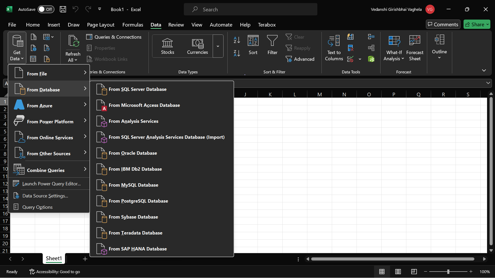
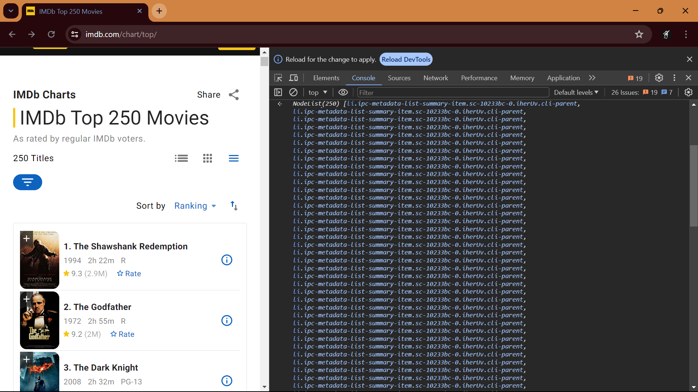
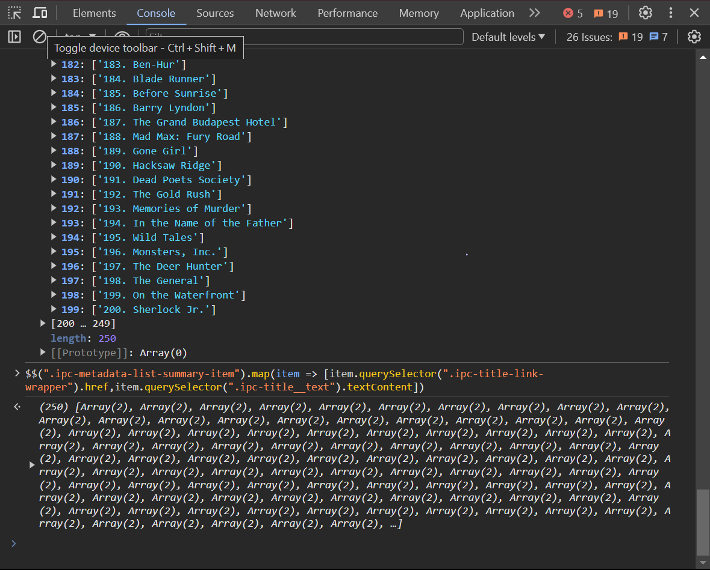
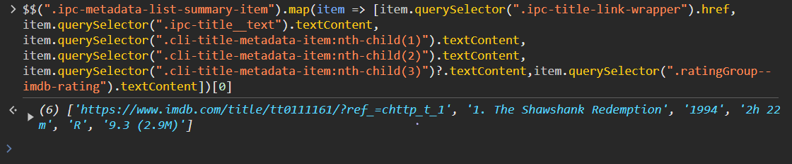

## Generic points.
- different types of data files:

1. **.tsv.gz** - tab seprated values.
2. **.csv** - comma seprated value.
3. **.xls** 
4. **.excel**
5. **.shp**
6. **.xml**

etc........

- **beautiful soup** is one of the python library used to **scrape** data from the web 

    a sample code with beautiful soup 

```python
#installing the dependencies.
pip install requests
pip install bs4
pip install beautifulsoup4 requests

#the code.
        import requests
        from bs4 import BeautifulSoup
        # URL of the page to scrape
        url = 'https://example.com'
        # Send a GET request to the webpage
        response = requests.get(url)
        # Check if the request was successful
        if response.status_code == 200:
            # Parse the HTML content of the page with BeautifulSoup
            soup = BeautifulSoup(response.content, 'html.parser')
            # Find and print the title of the page
            title = soup.title.string
            print('Page Title:', title)
            # Find and print all the hyperlinks on the page
            for link in soup.find_all('a'):
                print('Link:', link.get('href'))
            # Find and print all the paragraphs on the page
            for paragraph in soup.find_all('p'):
                print('Paragraph:', paragraph.text)
        else:
            print(f'Failed to retrieve the page. Status code: {response.status_code}')
```
---

# Methods of getting data

1. ***Download*** the data.

2. ***Query*** the data from somewhere, i.e the process of requesting specific information from a database or dataset via a query language or an API or is available via a library.

3. ***Scrape*** it from somehwere (brute froce only done when above 2 methods fail) i.e It's not directly available in a convenient form that you can query or download,  It's available on a PDF file, It's available in a Word document, It's available on an Excel file. It's kind of structured, but you will have to figure out that structure and extract it from there.
---

# Scrapping data with :-

> ***web scraping can not alawys be legal YOU will have to go through the T&C of a webiste if it's somehting really IMP***

## 1. Excel:

- use the query feature availbale in the data tab of excel

     

- eg

    [importing data in excel by creating a query](https://youtu.be/OCl6UdpmzRQ?si=XiIRU0ipxM4sf2-R)
---
## 2. Google sheets:

- `importhtml` is used in google sheets, which accepts the following parameter:

    1. url - the url from where the data is to be loaded
    2. query which will be a list or a tabel (depedning on the structre that contains the desired data) from the url
    3. index - the index of the table on that web page 

    eg

    ```importhtml("yourexampleurl.com","table",5)```

- the output here will be the result of a formula, so you might wanna paste it by values anywhere else in the workbook, and then strat editin the result.

- `importxml` is another formula to get XML, HTML, CSV, TSV, RSS and ATOM XML feeds, one good thing here is that you can pinpoint a specific element form which you want to get your data from.

- `importrange` range of cells from a specified spreadsheet

- `importfeed` imports RSS or ATOM feed.

- `importdata` imports data at a given url which has data in **.csv** formate.
---
## 3. With Python:

- it is doenne using the libraries :

    1. beautiful soup
    2. requests
    3. urllib
    4. scrapy [(can read the documentation here, its actually pretty cool 😎)](https://docs.scrapy.org/en/latest/)
    5. requests-html(this would not work out if you dont have chromium binaries in your system.)

- there are other libraries as well, which can be used along with these.

- The `requests` library is used to get the HTML content of the web page. The `BeautifulSoup` library from bs4 is used to parse the HTML content, so you would have to see the entire HTML doc to find the information you might need (so the simple way is not simple after all!!)

- for extracting the data, beautifulsoup's ***find_all()*** method is used.

- colab notebooks.
    1. [the colab notebook demonstrating just the use of the libraires](https://colab.research.google.com/drive/1-iV-tbtRicKR_HXWeu4Hi5aXJCV3QdQp#scrollTo=KEiuQasXBhal)
    2. [the colab notebook that does the scraping nd processing the data](https://colab.research.google.com/drive/1-gkMzE-TKe3U_yh1v0NPn4TM687H2Hcf)
    3. [colab notebook for nominatim](https://colab.research.google.com/drive/1-vvP-UyMjHgBqc-hdsUhm3Bsbgi7oO6g)

- A few more resources:

    1. [requests package in py](https://www.youtube.com/watch?v=tb8gHvYlCFs)
    2. [tutorial for beautiful soup package](https://youtu.be/ng2o98k983k)
    3. [re package](https://youtu.be/K8L6KVGG-7o)
    4. [nominatim package](https://nominatim.org/release-docs/develop/api/Overview/)
    5. [geopy and geocoders](https://geopy.readthedocs.io/)
---
## 4. with JS:

- [IMDb top 250](https://www.imdb.com/chart/top/)

- open the dev tools of the website whose data you want to scrape &rarr; simply inspect the element from which you want the data &rarr; check the class name of that element(the names in the class, which are seprated using spaces represent diff classes) &rarr; open console &rarr; write command &rarr;

```javascript
document.querySelectorAll(".ipc-metadata-list") //this is for the webpage used by the instrsuctor in the video.
//css query.
```

&rarr; the output you'll get is a `NodeList` that'll contain all the 250 movies (its length will be 1) but since we want the individual movies, we'll have to see the class nested within the ipc-metadata-list class which will be `ipc-metadata-list-summary-item ` &rarr; then well write the same command again 

```javascript
document.querySelectorAll(".ipc-metadata-list-summary-item") //this command will give a node list.
```

OR 

```javascript
$$(".ipc-metadata-list-summary-item")// this command will give a list.
```

nd this will get the info of all the 250 movies.



```javascript
document.querySelectorAll(".ipc-metadata-list-summary-item").map(item => item.txtContent) //will give the text content of all the movies 
// for getting the titles
$$(".ipc-metadata-list-summary-item").map(item => [item.querySelector(".ipc-title__text").textContent])
```


```javascript
// for getting the links of the movies along with the names.
$$(".ipc-metadata-list-summary-item").map(item => [item.querySelector(".ipc-title-link-wrapper").href,item.querySelector(".ipc-title__text").textContent])
```



```javascript
// for getting the year, duration and the rating and the "star" rating along with links of the movies along with the names.
$$(".ipc-metadata-list-summary-item").map(item => [item.querySelector(".ipc-title-link-wrapper").href,
item.querySelector(".ipc-title__text").textContent,
item.querySelector(".cli-title-metadata-item:nth-child(1)").textContent,
item.querySelector(".cli-title-metadata-item:nth-child(2)").textContent,
item.querySelector(".cli-title-metadata-item:nth-child(3)")?.textContent,
item.querySelector(".ratingGroup--imdb-rating").textContent])[0]//adding 0 to see just the first element.

// .querySelectorAll would have returned all the items contained in that specific class, so nth-child(<index>) would not have worked and would have given the output as undefined rather than the year of the movie.

// the question mark in the 2nd last line would only include the rating of the movie if its avalilale.

// the last line would also include the number of people who actually voted for the movie, but that could be removed after we get the data.
```



```javascript
// for getting the final data.
copy($$(".ipc-metadata-list-summary-item").map(item => [item.querySelector(".ipc-title-link-wrapper").href,
item.querySelector(".ipc-title__text").textContent,
item.querySelector(".cli-title-metadata-item:nth-child(1)").textContent,
item.querySelector(".cli-title-metadata-item:nth-child(2)").textContent,
item.querySelector(".cli-title-metadata-item:nth-child(3)")?.textContent,
item.querySelector(".ratingGroup--imdb-rating").textContent]))
```

- now we have got the data on the json file in the folder, we can then, manipulate it if we want.
---
## 5. scraping from a PDF from a given url:

- the most imp library is tabula.

```python
pip install tabula #for downlaoding the lib.
```
- [link to the pdf scraping colab notebook](https://colab.research.google.com/drive/102Fv2Ji0J4mvao3mCse52E7Th8bZiuyf)

```python
#one possible way to scrape the page using soup.
for link in soup.find_all('a', href=True):
    if link['href'].endswith('.pdf'):
        file_url = link['href']
        file_name = os.path.join(folder_path, file_url.split('/')[-1])
        with open(file_name, 'wb') as f:
            f.write(requests.get(file_url).content)
        print(f"Downloaded {file_name}")
        try:
            df = tabula.read_pdf(file_name, pages='all')
            for i, table in enumerate(df):
                table.to_csv(f'{file_name}_{i}.csv', index=False)
                print(f"Saved {file_name}_{i}.csv")
        except Exception as e:
            print(f"Error processing {file_name}: {e}")
        
```
---


## suplimentary videos to watch in free time and if you've implimented atleast 3 out of whatever is done above.
- [Real-life scraping](https://youtu.be/ZzUsDE1XjhE)

- [Fundamentals of web scraping with urllib and BeautifulSoup](https://youtu.be/I3auyTYORTs)

- [Intermediate web scraping using cookies](https://youtu.be/DryMIxMf3VU)

- [XML intro and scraping](https://youtu.be/8S_jvsjtaYg)

- search for the documentations of the packages if you get stuck somewhere or use GPT or copilot. 

# *--------fin----------*