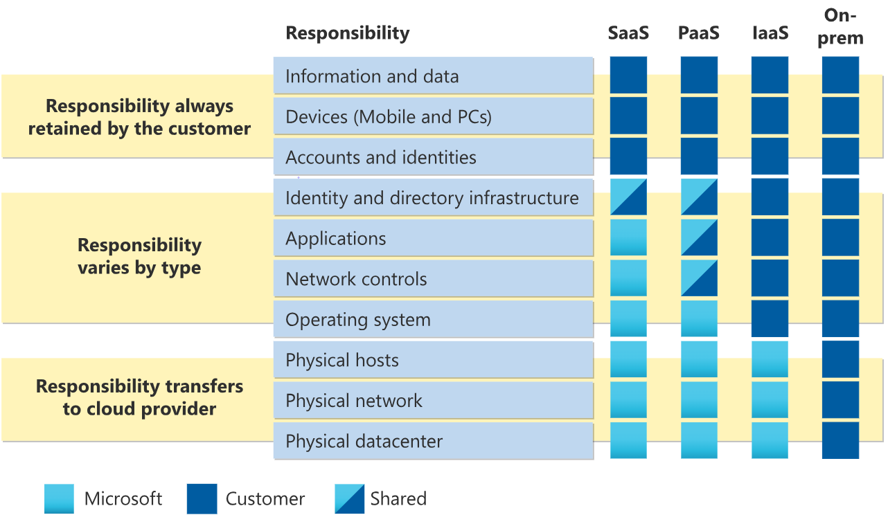

- Microsoft Azure is a cloud computing platform
- Azure has simple web services for hosting your business presence in the cloud. Azure also supports running fully virtualized computers managing your custom software solutions. 
- services like remote storage, database hosting, and centralized account management

## Intro to cloud computing.

- Concepts 

1. shared responsibility
2. different cloud models

    ### Cloud computing

- Cloud computing is the delivery of computing services over the internet
- services include common IT infrastructure such as virtual machines, storage, databases, and networking
- possible new services are IoT, ML nd AI over the internet.
- Because cloud computing uses the internet to deliver these services, it doesn’t have to be constrained by physical infrastructure the same way that a traditional datacenter is. That means if you need to increase your IT infrastructure rapidly, you don’t have to wait to build a new datacenter—you can use the cloud to rapidly expand your IT footprint.
- so bascically the servives mentioned above can be run even if you don't have a physical machine as all those services are over the internet, so the cloud becomes your computer. 

1. #### Shared responsibility model. 

- The IT department is responsible for maintaining all the infrastructure and software needed to keep the ***datacenter*** up and running. They’re also likely to be responsible for keeping all systems patched and on the correct version. With the *shared responsibility* model, these responsibilities get shared between the **cloud provider and the consumer**. Physical security, power, cooling, and network connectivity are the responsibility of the cloud provider. 
- The consumer is responsible for the data and information stored in the cloud. (You wouldn’t want the cloud provider to be able to read your information.) The consumer is also responsible for access security, meaning you only give access to those who need it.

     

    #### Responsibilities 

- When using a cloud provider, you’ll always be responsible for:

1. The information and data stored in the cloud
2. Devices that are allowed to connect to your cloud (cell phones, computers, and so on)
3. The accounts and identities of the people, services, and devices within your organization

- The cloud provider is always responsible for:

1. The physical datacenter
2. The physical network
3. The physical hosts

- Your service model will determine responsibility for things like:

1. Operating systems
2. Network controls
3. Applications

            Identity and infrastructure

2. ### The service models:
    1. Infrastructure as a Service (IaaS)
    2. Platform as a Service (PaaS)
    3. Software as a Service (SaaS)